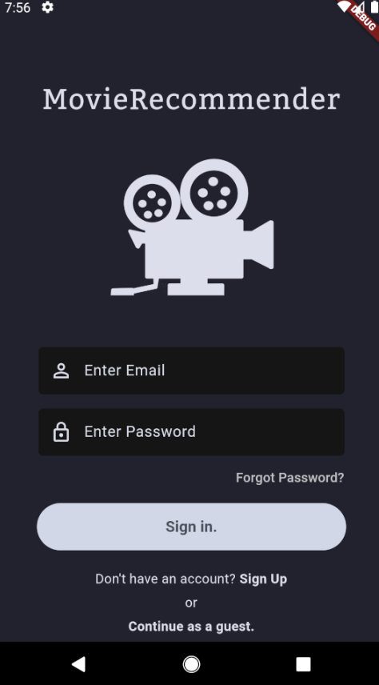
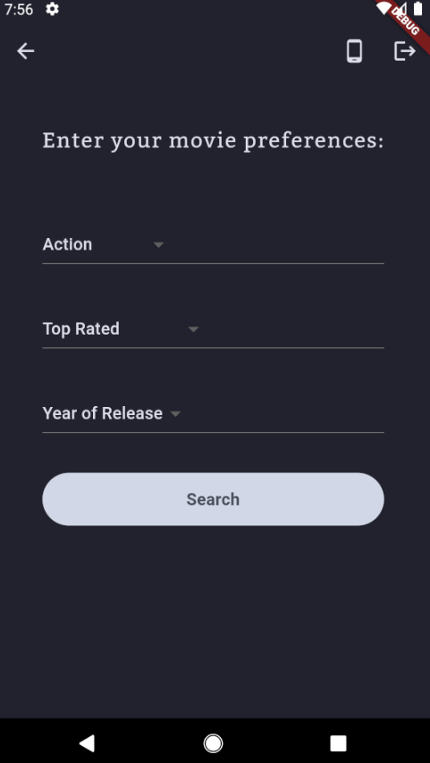
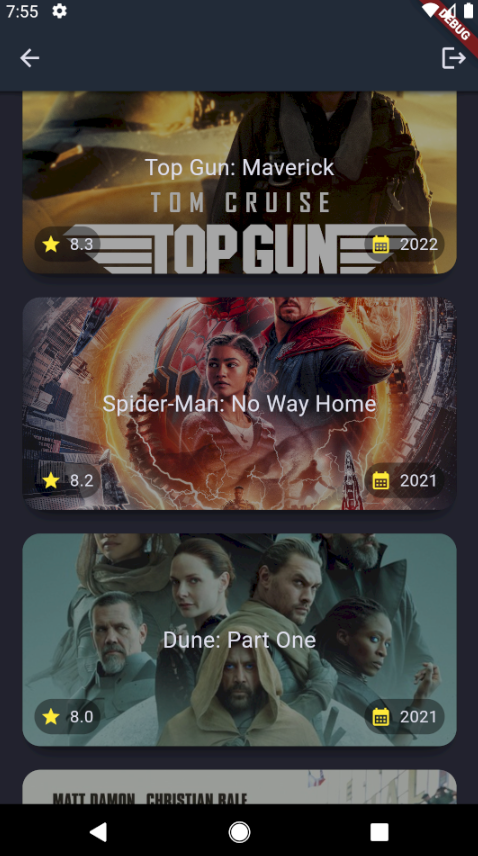

# MovieRecommender

MovieRecommender is a cross-platform mobile app built with **Flutter** that helps users discover movies and TV shows based on their preferences - genre, rating, and release year. Users can create an account, log in, or continue as a guest, then browse personalized recommendations pulled from a live movie database.


## Screenshots

| Sign In | Preferences | Recommendations |
|---|---|---|
|  |  |  |


## Stack

- **Framework:** Flutter (Dart)
- **Authentication & Backend:** Firebase Authentication
- **Movie Data:** RapidAPI
- **IDE:** Visual Studio Code
- **Testing Environment:** Android Studio (AVD / virtual device)


## How to Install

1. Clone the repository
   ```bash
   git clone https://github.com/Shoosht/MovieRecommender-Flutter.git
   cd MovieRecommender-Flutter
   ```
2. Install dependencies
   ```bash
   flutter pub get
   ```
3. Set up Firebase
   - Create a project in the Firebase Console
   - Enable Email/Password authentication
   - Add `google-services.json` (Android) or `GoogleService-Info.plist` (iOS)
4. Add your RapidAPI key
   - Create a `.env` file and add:
     ```
     RAPIDAPI_KEY=your_api_key_here
     ```
5. Run the app
   ```bash
   flutter run
   ```


## TODO

-  Add favorites / watchlist functionality
-  Add detailed movie/show pages
-  Dark/light theme toggle